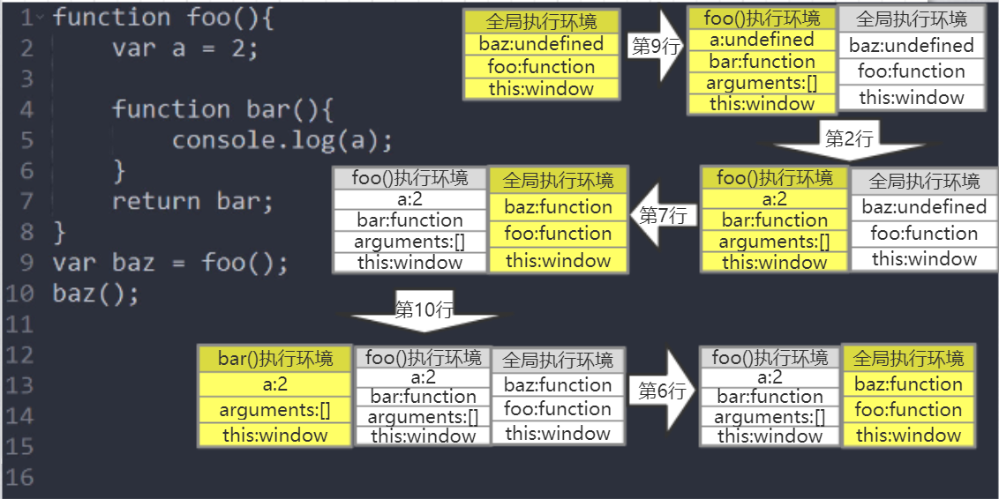

# 深入了解闭包

## 定义

闭包的定义比较混乱，不同人和不同的书籍有不同的理解。严格来说，闭包需要满足三个条件：【1】访问所在作用域；【2】函数嵌套；【3】在所在作用域外被调用

**经典定义**： 函数对象可以通过作用域链相互关联起来，函数体内的变量都可以保存在函数作用域内，这种特性在计算机科学文献中称为“闭包”（函数变量可以被隐藏于作用域链之内，因此看起来是函数将变量“包裹”了起来）

**从技术角度讲**: 所有 `JavaScript` 函数都是闭包：它们都是对象，它们都关联到作用域链。

**定义1**： 闭包是指可以访问其所在作用域的函数

**定义2**： 闭包是指有权访问另一个函数作用域中的变量的函数

**定义3**： 闭包是指在函数声明时的作用域以外的地方被调用的函数

**定义4**： 闭包是保存定义时的变量作用域

## 个人理解

我个人认为，闭包应该是一种思想，不同的人有不同的理解，我们不应该纠结闭包的概念到底是什么，而是应该理解这种思想背后的原理。

## 原理

首先要理解闭包必须要理解 `词法作用域` 和 `作用域链`

**词法作用域**： 函数的执行依赖于变量作用域，这个作用域是在函数定义时决定的，而不是函数运行时决定的。

**变量作用域**： 是成语选代码中定义这个变量的区域。

**作用域链**： 每一段 `JavaScript` 代码都有一个与之关联的作用域链。这个作用域链是一个对象列表或者链表，这组对象定义了这段代码“作用域中”的变量。当 `JavaScript` 需要查找变量 `x` 值的时候(`变量解析`) 它会从链的第一个对象开始查找，如果这个对象有一个名为 `x` 的属性，则会直接使用这个属性的值，如果不存在，`JavaScript` 会继续查找链上的下一个对象。以此类推。如果作用域链上不存在 `x` ，就认为这段代码作用域链上不存在 `x`，并最终跑出一个引用错误(`ReferenceError`)的异常。

理解了这些相关概念后，理解闭包就容易多了。我们通过一个例子来说明闭包的原理。



```javascript
function foo(){
    var a = 2;

    function bar(){
        console.log(a);
    }
    return bar;
}
var baz = foo();
baz();
```

【1】代码执行流进入全局执行环境，并对全局执行环境中的代码进行声明提升(`hoisting`)

【2】执行流执行第9行代码 `var baz = foo();`，调用 `foo()` 函数，此时执行流进入 `foo()` 函数执行环境中，对该执行环境中的代码进行声明提升过程。此时执行环境栈中存在两个执行环境，`foo()` 函数为当前执行流所在执行环境

【4】执行流执行第2行代码 `var a = 2;` ，对a进行 `LHS` 查询，给 `a` 赋值2

【5】执行流执行第7行代码 `return bar;` ，将 `bar()` 函数作为返回值返回。按理说，这时 `foo()` 函数已经执行完毕，应该销毁其执行环境，等待垃圾加收。但因为其返回值是 `bar` 函数。`bar` 函数中存在自由变量 `a`，需要通过作用域链到 `foo()` 函数的执行环境中找到变量 `a` 的值，所以虽然 `foo` 函数的执行环境被销毁了，但其变量对象不能被销毁，只是从活动状态变成非活动状态；而全局执行环境的变量对象则变成活动状态；执行流继续执行第9行代码 `var baz = foo();` ，把 `foo()` 函数的返回值 `bar` 函数赋值给 `baz`

【6】执行流执行第10行代码 `baz();` ，通过在全局执行环境中查找 `baz` 的值，`baz` 保存着 `foo()` 函数的返回值 `bar` 。所以这时执行 `baz()`，会调用 `bar()` 函数，此时执行流进入 `bar()` 函数执行环境中，对该执行环境中的代码进行声明提升过程。此时执行环境栈中存在三个执行环境， `bar()` 函数为当前执行流所在执行环境

在声明提升的过程中，由于a是个自由变量，需要通过 `bar()` 函数的作用域链 `bar() -> foo() -> 全局作用域` 进行查找，最终在 `foo()` 函数中也就是代码第2行找到 `var a = 2;` ，然后在 `foo()` 函数的执行环境中找到a的值是2，所以给a赋值2

【7】执行流执行第5行代码 `console.log(a);` ，调用内部对象 `console`，并从 `console` 对象中 `log` 方法，将a作为参数传递进入。从 `bar()` 函数的执行环境中找到a的值是2，所以，最终在控制台显示2

【8】执行流执行第6行代码，`bar()` 的执行环境被弹出执行环境栈，并被销毁，等待垃圾回收，控制权交还给全局执行环境

【9】当页面关闭时，所有的执行环境都被销毁

### 总结

从上述说明的第5步可以看出，由于闭包 `bar()` 函数的原因，虽然 `foo()` 函数的执行环境销毁了，但其变量对象一直存在于内存中，就是为了能够使得调用 `bar()` 函数时，可以通过作用域链访问到父函数 `foo()` ，并得到其变量对象中储存的变量值。直到页面关闭，`foo()` 函数的变量对象才会和全局的变量对象一起被销毁，从而释放内存空间

由于闭包占用内存空间，所以要谨慎使用闭包。尽量在使用完闭包后，及时解除引用，以便更早释放内存

```javascript
//通过将baz置为null，解除引用
function foo(){
    var a = 2;
    function bar(){
        console.log(a);//2
    }
    return bar;
}
var baz = foo();
baz();
baz = null;
//后续代码
```